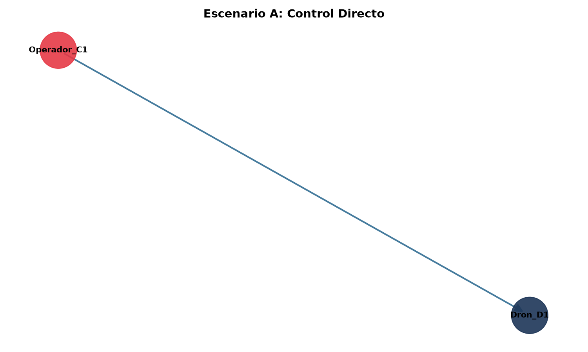
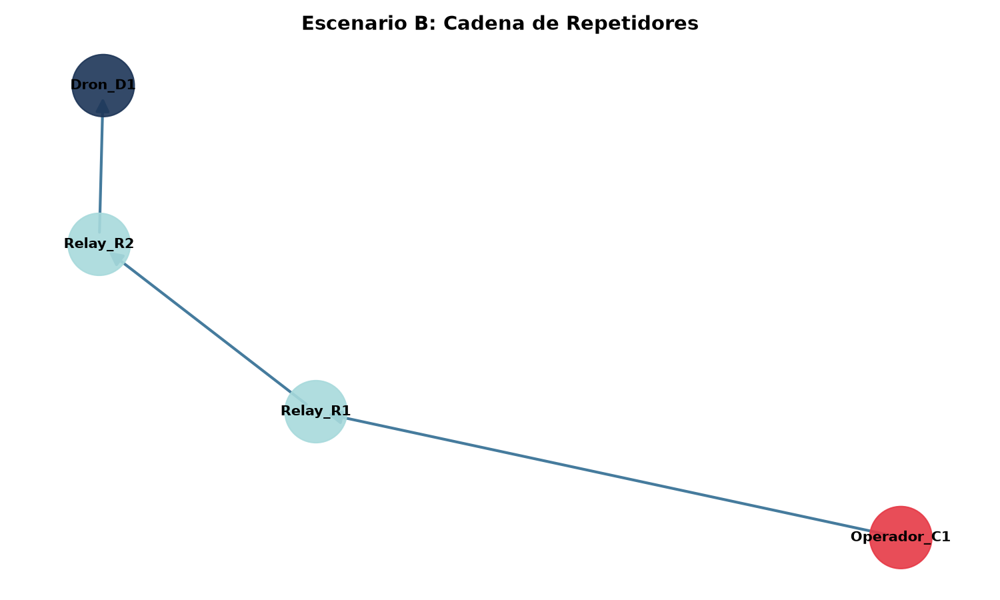
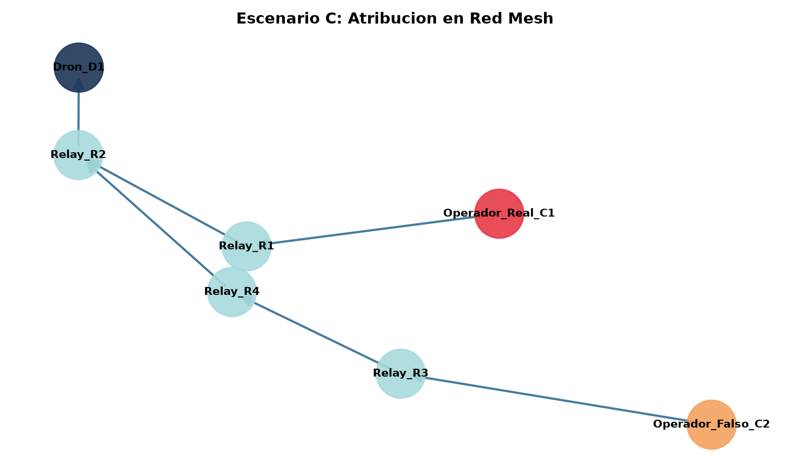
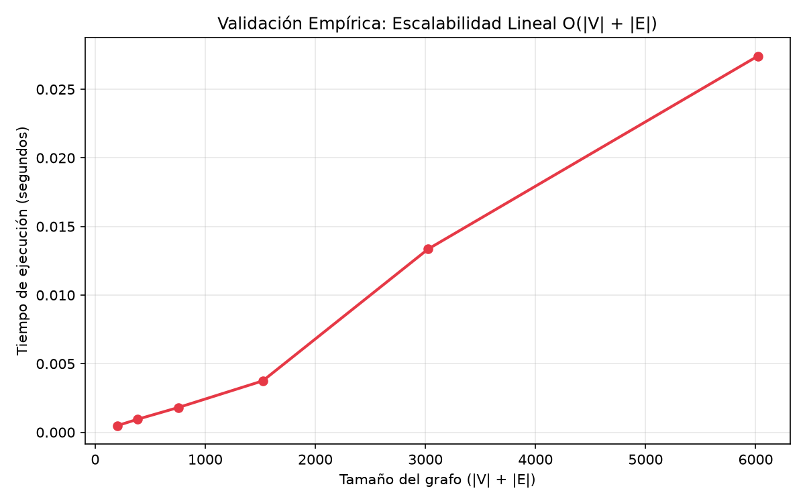

# Algoritmos de Atribución en Redes de Comunicación: Identificación del Nodo Origen en Sistemas de Aeronaves No Tripuladas (UAS)

**Autor:** Erik Santiago Martinez Perez 
**Asignatura:** Matemáticas Discretas I – Ingeniería de Sistemas  

---

## Resumen
La proliferación ilícita de sistemas aéreos no tripulados (UAS) en zonas restringidas plantea un desafío de seguridad crítico debido a la anonimización del operador. Este trabajo presenta un modelo formal sustentado en Teoría de Grafos Dirigidos para determinar el nodo origen (emisor primario) en una red de señales de mando y control $C2$. A partir de la captura topológica de la red y la interceptación de un dron objetivo, se implementa un algoritmo de trazabilidad invertida sobre el Grafo Transpuesto $G^T$. El modelo evalúa propiedades de grado de entrada $d^-(v) = 0$, maneja casos ambiguos mediante caminos mínimos y procesa redes desconectadas. Los experimentos demostraron la efectividad del algoritmo con una complejidad computacional de $\mathcal{O}(|V| + |E|)$.

---

## 1. Introducción y Planteamiento del Problema
Las incursiones no autorizadas de drones contra infraestructura civil y militar evidencian que las estrategias defensivas tradicionales basadas en la neutralización física del dispositivo son insuficientes. Para mitigar la recurrencia de estos ataques, es indispensable identificar y ubicar prontamente la estación de control terrestre (GCS) o al operador humano.

El desafío técnico radica en la presencia de nodos intermediarios (repetidores o *relays*) que ocultan la fuente original de transmisión. Por ello, se formula la siguiente pregunta de investigación: **¿Es posible, mediante el análisis de la topología de red y métricas discretas de centralidad, determinar computacionalmente el nodo raíz responsable de la operación?**

---

## 2. Formulación Matemática Formal

### 2.1. Definición de la Red como Dígrafo
Se modela la arquitectura de comunicación como un dígrafo $G = (V, E)$, donde:
* $V = C \cup R \cup D$ es el conjunto disjunto de vértices, representando Controladores ($C$), Repetidores ($R$) y Drones ($D$).
* $E \subseteq V \times V$ representa los enlaces unidireccionales de transmisión de mando y control ($C2$).

### 2.2. Caracterización del Nodo Origen
Un vértice $v \in V$ se clasifica formalmente como un **Emisor Primario** si satisface:
$$v \in C \iff d^-(v) = 0 \quad \land \quad d^+(v) > 0$$

Donde $d^-(v)$ denota el grado de entrada y $d^+(v)$ el grado de salida en $G$.

### 2.3. Trazabilidad Inversa y Grafo Transpuesto ($G^T$)
Dada la interceptación del dron $d_{target} \in D$, se construye el Grafo Transpuesto $G^T = (V, E^T)$ con $E^T = \{(v, u) \mid (u, v) \in E\}$. 

**Propiedad de Distancia Equivalente:** Un recorrido en anchura (BFS) en $G^T$ desde $d_{target}$ identifica la distancia hacia cualquier ancestro $v$, cumpliendo estrictamente que:
$$d_{G^T}(d_{target}, v) = d_G(v, d_{target})$$

### 2.4. Desempate y Casos Borde
* **Ambigüedad con Múltiples Candidatos:** Si $|C_{candidatos}| > 1$, el operador óptimo se selecciona mediante:
  $$C_{optimo} = \arg\min_{v \in C_{candidatos}} d_G(v, d_{target})$$
* **Red Desconectada:** Si $C_{candidatos} = \emptyset \implies \text{Atribución no determinable (datos incompletos o red fragmentada)}$.

### 2.5. Complejidad Computacional
La construcción de $G^T$ requiere $\mathcal{O}(|E|)$ y el recorrido BFS explora el subgrafo en $\mathcal{O}(|V| + |E|)$. Por ende, la complejidad total es de orden lineal **$\mathcal{O}(|V| + |E|)$**.

---

## 3. Diseño Algorítmico

A partir de la formulación anterior, el procedimiento de atribución se expresa mediante el siguiente pseudocódigo, base directa de la implementación en `src/attribution_engine.py`:

```text
Algoritmo IDENTIFICAR-EMISOR-PRIMARIO(G, d_target)
Entrada: Grafo dirigido G = (V, E), nodo dron interceptado d_target
Salida: (emisor_optimo, distancia, candidatos)

1. Si d_target no pertenece a V:
   retornar error de nodo inexistente

2. G^T <- TRANSPONER(G) // O(|V| + |E|)

3. dist <- BFS(G^T, origen = d_target) // distancias desde d_target en G^T;
   // por la Propiedad de Distancia
   // Equivalente (Sección 2.3), estas
   // corresponden a d_G(v, d_target)

4. candidatos <- conjunto vacío

5. para cada nodo v alcanzado en dist:
   si grado_entrada_G(v) = 0 Y v != d_target:
      candidatos <- candidatos U {v}

6. si candidatos = conjunto vacío:
   retornar (None, infinito, conjunto vacío)

7. emisor_optimo <- argmin_{v en candidatos} dist[v]

8. retornar (emisor_optimo, dist[emisor_optimo], candidatos)
```
El algoritmo opera enteramente sobre estructuras de adyacencia (sin recorrer la matriz $A$ de forma explícita), lo que garantiza que cada paso se ejecute en tiempo lineal respecto al tamaño de la red, tal como se demostró en la Sección 2.5.

---

## 4. Implementación y Arquitectura del Sistema
El prototipo computacional se desarrolló en Python estructurado en tres módulos principales:
1. `src/graph_builder.py`: Constructor programático de topologías de red (Estrella, Cadena, Mesh y Desconectada).
2. `src/attribution_engine.py`: Motor algorítmico que ejecuta la inversión de aristas en $G^T$, el filtrado de $d^-(v) = 0$ y la resolución de ambigüedades.
3. `src/visualizer.py`: Motor gráfico basado en `networkx` y `matplotlib` para la diferenciación cromática de roles en la red.

El código cuenta con una suite de pruebas automatizadas (`tests/test_attribution.py`) ejecutadas bajo el framework `pytest`.

---

## 5. Resultados y Análisis Experimental

### Escenario A: Control Directo Punto a Punto
* **Configuración:** Conexión directa $C_1 \to D_1$.
* **Resultado:** Identificación directa de `Operador_C1` a distancia $d=1$.


### Escenario B: Cadena de Repetidores Terrestres
* **Configuración:** Cadena $C_1 \to R_1 \to R_2 \to D_1$.
* **Resultado:** El algoritmo descartó los repetidores $R_1$ y $R_2$ por satisfacer $d^-(r) \ge 1$, atribuyendo correctamente la operación a `Operador_C1` a distancia $d=3$.


### Escenario C: Red Mesh Compleja y Desempate por Distancia
* **Configuración:** Dos emisores candidatos (`Operador_Real_C1` a distancia 3 y `Operador_Falso_C2` a distancia 4) convergiendo en la red.
* **Resultado:** El motor detectó ambos candidatos en $C_{candidatos}$ y aplicó el desempate por camino mínimo, seleccionando exitosamente a `Operador_Real_C1`.


### Caso Borde: Red Desconectada
* **Configuración:** Dron aislado $D_1$ sin enlaces dirigidos desde ningún operador.
* **Resultado:** Salida `None`, distancia `inf` y $C_{candidatos} = \emptyset$, validando el manejo de datos incompletos sin colapsar el software.

---
### Validación Empírica de la Complejidad Computacional
* **Configuración:** Se generaron redes por capas de tamaño creciente (5 a 160 capas, 15 nodos por capa), midiendo el tiempo de ejecución de `identify_primary_emitter` sobre cada una.
* **Resultado:** El tiempo de ejecución exhibe un crecimiento aproximadamente lineal respecto a $|V| + |E|$, sin evidencia de comportamiento cuadrático o superior, confirmando empíricamente la complejidad teórica $\mathcal{O}(|V| + |E|)$ derivada en la Sección 2.5.

---
## 6. Conclusiones
1. La Teoría de Grafos Dirigidos proporciona una herramienta matemáticamente rigurosa para abstraer la infraestructura de red UAS y resolver el problema de anonimización de operadores.
2. La utilización del Grafo Transpuesto $G^T$ combinado con el filtrado del grado de entrada $d^-(v) = 0$ permite rastrear eficientemente el origen de la señal en tiempo lineal $\mathcal{O}(|V| + |E|)$.
3. El enfoque de desempate por camino mínimo en dígrafos acíclicos permite resolver escenarios con emisiones falsas o repetidores compartidos de manera determinista.
4. **Trabajo futuro:** el modelo actual asume enlaces homogéneos sin pérdida de señal; una extensión natural consiste en asignar un peso de confiabilidad decreciente por cada salto a través de un repetidor, transformando el desempate de mínimo número de saltos a mínimo costo acumulado, lo cual acercaría el modelo a condiciones reales de degradación de señal RF.
